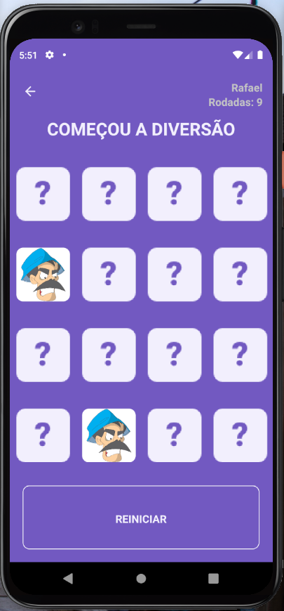
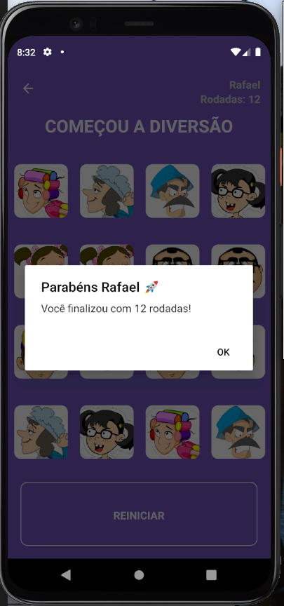

# Resultado Final

  
  
  

<br /> <br />

# `Indice`

<a href="#Tecnologias-utilizadas">1. Tecnologias utilizadas</a> <br />
<a href="#Como-rodar-o-projeto">2. Como rodar o projeto</a>

---

## Tecnologias utilizadas

O projeto foi desenvolvido utilizando as seguintes tecnologias:

- React-Native
- Axios
- TypeScript
- Styled-Components
- react-navigation/native
- react-native-vector-icons

---

## Como baixar o projeto

```bash

  # Clonar o repositório
  $ git clone https://github.com/DevTeles/memoryGame.git

  # Entrar dentro da pasta "memoryGame"
  $ cd memoryGame

  # Instalar as dependências
  $ yarn

  # Executar o projeto
  $ yarn start
  $ yarn android ou yarn ios
```

<br /><br />

## 🚀🚀🚀

Desenvolvido com 💖 por **Rafael Teles Vital**
